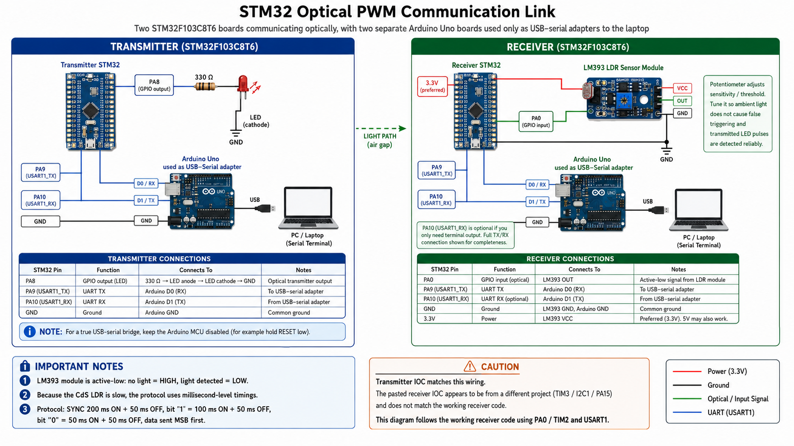

# STM32 Light Fidelity Communication

A custom optical wireless communication system between two STM32 microcontrollers using millisecond-level PWM pulses over an LED-LDR air gap.

## Overview

This project implements one-way optical communication using:

- STM32 transmitter
- STM32 receiver
- LED as optical transmitter
- LM393 LDR sensor module as optical receiver
- UART terminal input/output or SSD1306 OLED output

The transmitter receives characters from a PC terminal using UART interrupt reception, stores them in a circular buffer, and flashes them through an LED/Laser using a custom PWM protocol.

The receiver uses TIM2 Input Capture to measure the optical pulse widths from the LM393 LDR module and reconstructs the transmitted characters. The output can be viewed using another USART Terminal or an OLED such as SSD1306 as used in the project.

## Hardware

### Transmitter

- PA8: GPIO output to LED
- USART1: PC terminal input

### Receiver

- PA0: LM393 LDR digital output
- TIM2 CH1/CH2: Input Capture
- USART1: PC terminal output / SSD1306 OLED output display

## Optical PWM Protocol

| Symbol | LED ON Time | LED OFF Gap |
|---|---:|---:|
| SYNC | 200 ms | 50 ms |
| Bit 1 | 100 ms | 50 ms |
| Bit 0 | 50 ms | 50 ms |

Data is transmitted MSB first.

## Important Note

The LM393 LDR module is active-low:

- No light: output HIGH
- Light detected: output LOW

Therefore, the receiver starts timing on a falling edge and stops timing on a rising edge.

## Output Display

The received characters can be viewed in two ways:

1. On a PC serial terminal such as PuTTY.
2. On an SSD1306 OLED display connected to the receiver STM32.

The receiver project includes the SSD1306 OLED driver files inside the `receiver/Drivers` section. These files are used to interface the OLED display with the STM32 through I2C.

Reference used for OLED interfacing:  
https://youtu.be/z1Px6emHIeg?si=05Hiy61_TqxIMN5F


## SSD1306 OLED Connections

The SSD1306 OLED display is connected to the receiver STM32 using I2C1.

| SSD1306 OLED Pin | STM32F103C8T6 Pin | Description |
|---|---|---|
| VCC | 3.3V | OLED power supply |
| GND | GND | Ground |
| SCL | PB6 | I2C1 clock |
| SDA | PB7 | I2C1 data |

-- Note: Use 3.3V for the OLED supply to keep the logic levels safe for the STM32.

This makes the receiver usable both with and without constantly checking the PC terminal.


## Optional Range Improvement

To improve the range and direction of the optical link, the LED can be replaced with a suitable low-power laser module.

The laser should be selected carefully based on safe power rating and wavelength. Do not use high-power lasers, and avoid looking directly into the beam.

## Project Structure

```text
stm32-optical-pwm-link/
├── transmitter/
├── receiver/
├── README.md
└── .gitignore

## UART Settings

```text
Baud rate: 9600
Data bits: 8
Parity: None
Stop bits: 1
Flow control: None
```

## Status

Working prototype tested with STM32CubeIDE and HAL library.


## Hardware Setup


